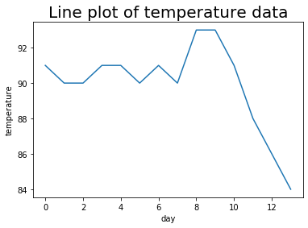
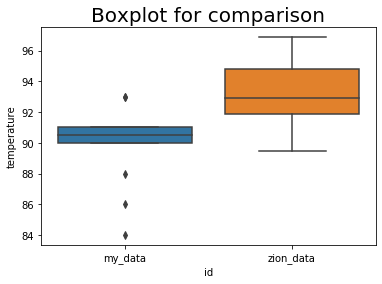

# NBA Data Analysis – Python

## Overview
This project analyzes NBA team data using Python to identify performance trends and statistical relationships. The goal was to determine which variables best predict team success using statistical analysis and visualization.

## Technologies Used
- Python
- Pandas
- NumPy
- Matplotlib
- Seaborn

## What I Did
- Cleaned and prepared NBA dataset for analysis
- Calculated descriptive statistics (mean, variance, standard deviation)
- Created visualizations to explore trends
- Built regression models to predict team wins
- Analyzed correlations between performance metrics and wins

## Key Skills Demonstrated
- Data analysis with Python
- Statistical modeling (correlation and regression)
- Data cleaning and transformation
- Data visualization
- Interpreting real-world datasets

## Visualizations

### Line Graph (Trend Analysis)

### Boxplot Comparison

## Key Findings
- Teams with higher relative skill (Elo rating) strongly correlate with more wins (~0.91 correlation)
- Points scored has a moderate impact (~0.48 correlation)
- Point differential and skill differential are the strongest predictors of wins
- Combined regression models explained up to ~88% of win variation

## Outcome
This project improved my ability to use Python for statistical analysis and data visualization. It also helped me understand how different variables impact performance and how data can be used to support decision-making.

## How to View
- `Project Three Jupyter Script.html` – Full analysis with code and results
- Full written report included in project documentation
